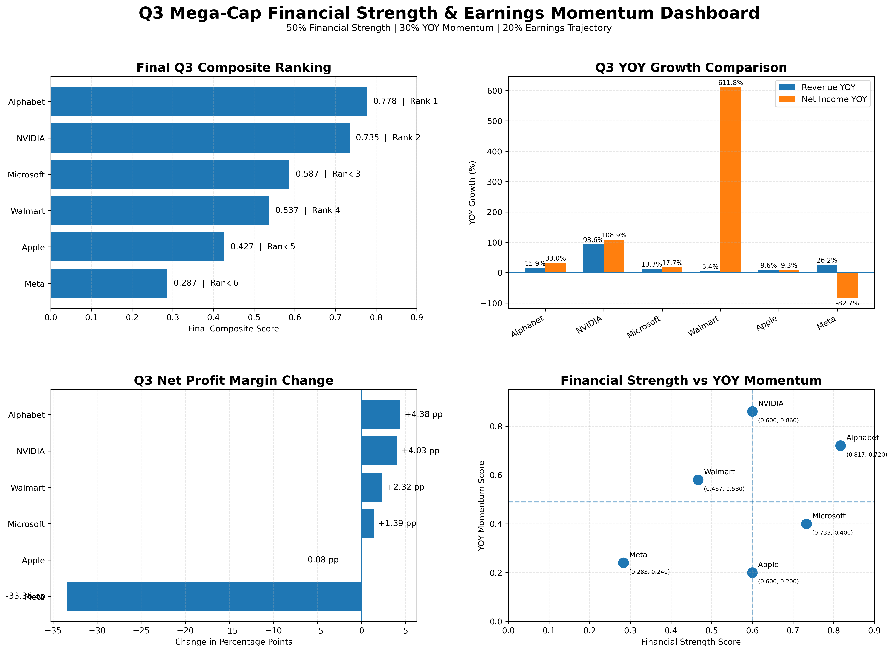

# Q3 Mega-Cap Financial Analysis

Python-based comparative financial analysis of six mega-cap companies using SEC filings, Q3 YOY growth, financial strength, earnings trajectory, and multi-factor ranking.

## 📊 Project Overview

This project evaluates the financial performance and earnings momentum of six major U.S. mega-cap companies:

* Alphabet Inc.
* NVIDIA Corp.
* Microsoft Corp.
* Walmart Inc.
* Apple Inc.
* Meta Platforms, Inc.

The analysis compares **Q3 FY2025 against Q3 FY2024** on a year-over-year basis and combines multiple financial dimensions into a final composite ranking.

## 🎯 Objectives

The project aims to answer:

1. Which company demonstrated the strongest Q3 financial performance?
2. Which companies showed the strongest YOY momentum?
3. Which companies have accelerating or deteriorating earnings trajectories?
4. How does financial strength compare with earnings momentum?
5. Does the final ranking remain stable when factor weights change?

## 📅 Comparison Period

All companies are evaluated using their respective **Q3 FY2025 results versus Q3 FY2024 results**.

Because fiscal calendars differ between companies, the analysis uses the company's reported fiscal-quarter periods rather than assuming identical calendar dates.

The YOY comparison is therefore:

**Q3 FY2025 → Q3 FY2024**

rather than comparing Q3 FY2025 with Q2 or Q3 FY2026.

## 📈 Key Metrics

### 1. Revenue YOY Growth

Measures the percentage change in quarterly revenue compared with the same fiscal quarter in the prior year.

### 2. Net Income YOY Growth

Measures the percentage change in quarterly net income compared with the corresponding prior-year quarter.

### 3. Net Profit Margin Change

Measures the change in net profit margin in percentage points between the current and prior-year quarter.

### 4. Financial Strength

A normalized composite score representing the company's underlying financial performance.

### 5. YOY Momentum

A normalized score based on relative revenue growth, net income growth, and margin expansion.

### 6. Earnings Trajectory

The earnings trajectory evaluates whether the company's earnings performance is moving in a favorable or unfavorable direction based on:

* Revenue growth
* Net income growth
* Margin expansion or contraction

Companies are classified into categories such as:

* **Accelerating**
* **Profitable Growth**
* **Deteriorating**

## 🧮 Final Composite Ranking

The final score combines three dimensions:

| Factor              | Weight |
| ------------------- | -----: |
| Financial Strength  |    50% |
| YOY Momentum        |    30% |
| Earnings Trajectory |    20% |

The final composite score is therefore:

**Final Score = 50% Financial Strength + 30% YOY Momentum + 20% Earnings Trajectory**

## 🏆 Final Q3 Ranking

| Rank | Company              | Financial Strength | YOY Momentum | Earnings Trajectory | Final Score | Trajectory        |
| ---: | -------------------- | -----------------: | -----------: | ------------------: | ----------: | ----------------- |
|    1 | Alphabet Inc.        |              0.817 |        0.720 |               0.767 |   **0.778** | Accelerating      |
|    2 | NVIDIA Corp.         |              0.600 |        0.860 |               0.883 |   **0.735** | Accelerating      |
|    3 | Microsoft Corp.      |              0.733 |        0.400 |               0.500 |   **0.587** | Accelerating      |
|    4 | Walmart Inc.         |              0.467 |        0.580 |               0.650 |   **0.537** | Accelerating      |
|    5 | Apple Inc.           |              0.600 |        0.200 |               0.333 |   **0.427** | Profitable Growth |
|    6 | Meta Platforms, Inc. |              0.283 |        0.240 |               0.367 |   **0.287** | Deteriorating     |

## 📊 Dashboard

The project includes a four-panel financial dashboard covering:

* Final Q3 composite ranking
* Revenue and net income YOY growth
* Net profit margin change
* Financial strength versus YOY momentum



## 🔍 Key Findings

### Alphabet — Overall Leader

Alphabet ranks first on the final composite score, combining the strongest financial strength among the companies analyzed with strong YOY momentum and an accelerating earnings trajectory.

### NVIDIA — Strongest Momentum

NVIDIA records the strongest YOY momentum and earnings trajectory in the group, driven by exceptionally high revenue and net income growth.

Its lower financial-strength score relative to Alphabet prevents it from ranking first in the final composite model.

### Microsoft — Strong Financial Foundation

Microsoft demonstrates strong financial strength but comparatively moderate YOY momentum, resulting in a third-place overall ranking.

### Walmart — Consistent Growth

Walmart shows relatively modest revenue growth but strong net income growth and positive margin expansion, resulting in an accelerating earnings trajectory.

### Apple — Profitable but Slower Momentum

Apple maintains solid financial strength but has weaker YOY momentum and limited margin expansion compared with the leaders.

### Meta — Weakest Overall Trajectory

Meta shows strong revenue growth but a substantial decline in net income and a significant contraction in net profit margin, resulting in a deteriorating earnings trajectory.

## 🔬 Sensitivity Analysis

The analysis tests whether the final ranking is dependent on the selected weighting scheme.

The financial-strength/momentum weighting was varied across:

* 70% / 30%
* 60% / 40%
* 50% / 50%
* 40% / 60%
* 30% / 70%

The ranking remains relatively stable across the tested weighting scenarios.

Alphabet and NVIDIA consistently occupy the top two positions, while Apple and Meta remain near the bottom.

This suggests that the core ranking is not driven solely by one specific weighting assumption.

## 🧠 Methodology & Classification Rules

The methodology follows these principles:

1. Use reported quarterly financial data from SEC filings.
2. Compare each company's Q3 FY2025 results with its corresponding Q3 FY2024 results.
3. Respect company-specific fiscal calendars.
4. Identify the appropriate revenue and net income XBRL tags for each company.
5. Calculate YOY growth rates.
6. Calculate net profit margin for both periods.
7. Calculate the change in net profit margin in percentage points.
8. Normalize financial metrics to create comparable scores across companies.
9. Combine the factor scores using the defined weighting methodology.
10. Perform sensitivity analysis to test ranking stability.

## 🛠️ Technology & Data

**Languages & Libraries**

* Python
* Pandas
* NumPy
* Matplotlib

**Data Source**

* U.S. SEC filings / XBRL financial data

**Analysis Techniques**

* Financial statement analysis
* YOY growth analysis
* Financial normalization
* Composite scoring
* Ranking methodology
* Sensitivity analysis
* Data visualization

## 📁 Repository Structure

```text
Q3-Mega-Cap-Financial-Analysis/
│
├── Q3_Financial_Analysis.ipynb
├── Q3_Financial_Analysis_Dashboard.png
├── README.md
└── requirements.txt
```

## 🚀 How to Run

Clone the repository and install the required Python packages:

```bash
pip install -r requirements.txt
```

Then open:

```text
Q3_Financial_Analysis.ipynb
```

and run the notebook cells sequentially.

## 📌 Disclaimer

This project is intended for educational, analytical, and portfolio purposes. It does not constitute investment advice or a recommendation to buy or sell securities.

## 👤 Author

**Rajnish Gautam**

Data Analyst | Financial Analysis | Equity Research | Python & Data Analytics | MBA Finance 
